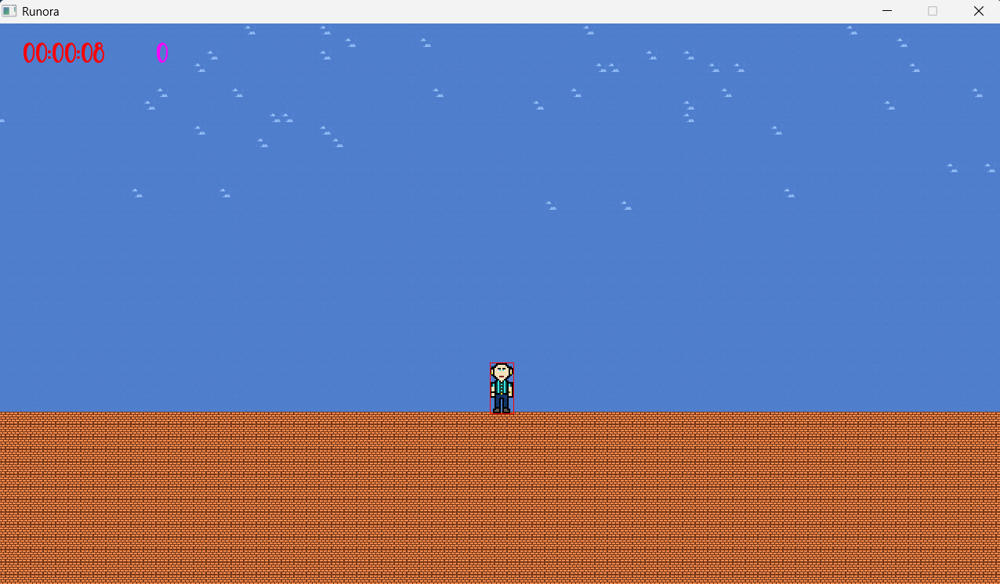

# Runora

## Project Overview (C++ / SFML 3.0.0)

⚠️ **Note:** This project is still under development. 

Runora is a personal project created with the **goal of learning and practicing C++** while building a basic 2D game.  
The game is an **endless runner** where the player controls a character that collects **aura orbs**, which increase the overall score.  

The name *Runora* comes from combining the words **"Run"** and **"Aura"**, reflecting both the gameplay style and the collectible items.

---

## Features

- **Basic Controls**:  
  - D → Move right  
  - Space → Jump  

- **Gameplay Elements**:  
  - Procedurally generated map  
  - Introduction of specific abilities (still to be defined)  
  - Collect aura orbs to increase score  

- **Technical Features**:  
  - Rendering, UI, and visuals with **SFML**  
  - Object-Oriented Programming patterns  
  - Modular code design  
  - Structured folder organization with build automation using **CMake**  

---

## How to Setup and Run (Windows)

1. **Build the project**  
   ```bash
   cmake -S . -B build -G "MinGW Makefiles" -DCMAKE_BUILD_TYPE=Release

2. **Compile the project**
    ```bash
    cmake --build build --parallel 4

3. **Run the game**
    ```bash
    ./build/Runora.exe

💡 A pre-compiled version is also available.

---

## Preview

Here is a preview of the current state of the game:


