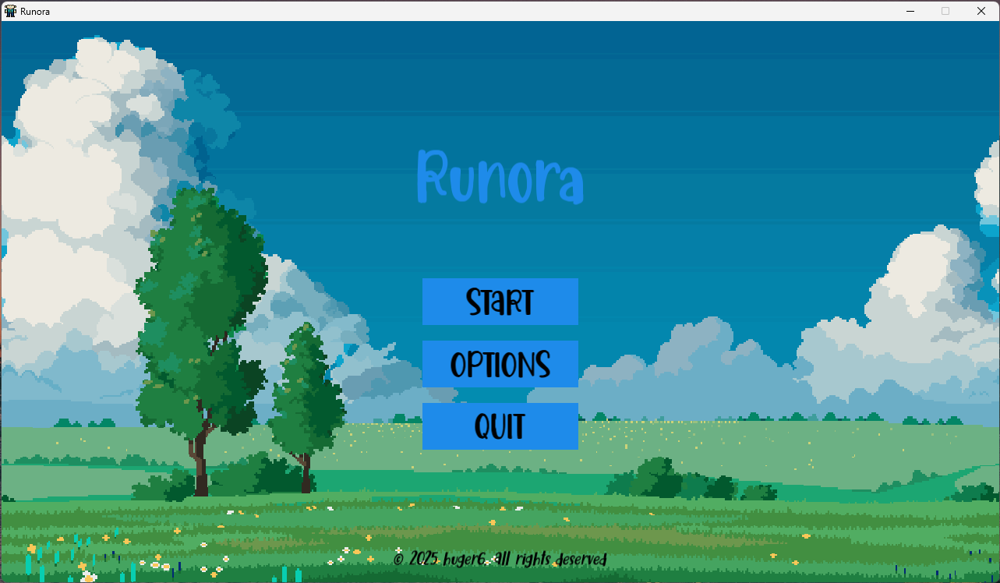
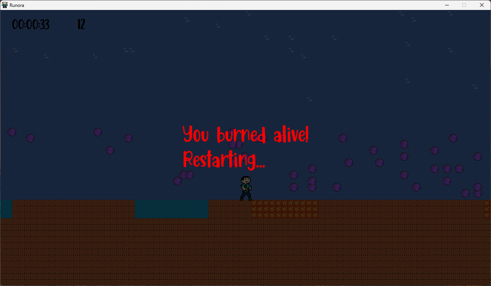

# Runora

Runora is a 2D endless runner built from scratch in **C++** with **SFML 3.0.0**. The player sprints through a procedurally generated world, collecting **aura orbs** to rack up score while dodging deadly **water** and **lava** hazards that appear along the path. One wrong step means instant death — jump wisely. The name *Runora* comes from combining **"Run"** and **"Aura"**, reflecting both the gameplay and the collectible items. This project was created as a personal learning exercise for C++ and game development fundamentals.


> *Demonstration: Game may feel laggy because of the GIF display -> check the full video <a href="/results/drowned.mp4">here</a>.*
---

## Table of Contents

- [Gameplay](#gameplay)
- [Controls](#controls)
- [Game Mechanics](#game-mechanics)
- [Technical Details](#technical-details)
- [Project Structure](#project-structure)
- [How to Build and Run](#how-to-build-and-run)
- [Gallery](#gallery)
- [License](#license)

---

## Gameplay

Runora is an **infinite side-scrolling runner**. The world generates itself as the player moves forward — terrain, clouds, orbs, and hazards are all created procedurally so every run feels different. The goal is simple: survive as long as possible, collect as many aura orbs as you can, and beat your own time.

The game features a **main menu**, a **pause menu** (Escape key), and a full **HUD** displaying elapsed time and orb count during gameplay.

---

## Controls

| Key | Action |
|-----|--------|
| **D** | Move right |
| **A** | Move left |
| **Space** | Jump / Double jump |
| **Escape** | Pause / Resume |

---

## Game Mechanics

### Movement & Physics
The player character uses a **physics-based movement system** with realistic acceleration, deceleration, and gravity. Horizontal movement ramps up smoothly and decelerates with friction when keys are released. The physics engine uses **Velocity Verlet integration** for accurate position updates.

### Double Jump
The player can jump **twice** — once from the ground and once mid-air. The double jump allows clearing longer hazard segments that a single jump cannot reach. Timing and momentum are key.

### Aura Orbs
Glowing **aura orbs** spawn throughout the world ahead of the player. Walking or jumping through them collects them and increases the score displayed in the HUD. Orbs are generated probabilistically and despawn once they fall behind the camera.

### Hazards — Water & Lava
Segments of **water** and **lava** pools replace sections of the ground at varying intervals. They range from **3 to 16 tiles wide** — short ones can be cleared with a simple hop, while longer ones demand a full-speed double jump. Touching any hazard tile results in **instant death**.

- **Water** — blue pools. *"You drowned!"*
- **Lava** — orange pools. *"You burned alive!"*

A safe zone at the start of each run gives the player time to get moving before hazards begin appearing.

### Death & Restart
When the player touches a hazard, the game freezes with a **death screen overlay** showing what happened. After a few seconds, all stats (timer, orbs, position) reset and the game restarts from the beginning.

### HUD
The heads-up display shows:
- **Timer** — tracks how long the current run has lasted
- **Orb counter** — total aura orbs collected this run

### Procedural Generation
The world is divided into **chunks** (80×20 tiles each). Chunks are loaded and unloaded dynamically based on the player's position. Terrain features include:
- **Brick ground** tiles
- **Cloud** decorations in the sky (generated with hash-based probability)
- **Hazard segments** placed via deterministic zone hashing, ensuring consistent placement across chunk boundaries

---

## Technical Details

| | |
|---|---|
| **Language** | C++20 |
| **Graphics** | SFML 3.0.0 |
| **Build System** | CMake 3.20+ |
| **Compiler** | MinGW (GCC) |
| **Data Format** | JSON (nlohmann/json) for tileset and orb definitions |

### Architecture Highlights
- **Object-Oriented Design** — clean class hierarchy for Player, Tiles, Chunks, Orbs, HUD, Menus, and Game State
- **Modular structure** — separated into `Player/`, `World/`, `HUD/`, `Graphics/`, `Utils/`, and `app/`
- **Chunk-based world** — infinite scrolling with on-demand procedural generation and automatic cleanup
- **Deterministic hashing** — hazards and clouds use hash functions seeded by tile/zone coordinates for reproducible worlds
- **Vertex array rendering** — tiles and orbs are batch-rendered via `sf::VertexArray` for performance
- **Delta-time physics** — frame-rate independent movement with clamped delta time
- **Game state machine** — manages transitions between Main Menu, Playing, Pause, and Exit states

---

## Project Structure

```
Runora/
├── assets/
│   ├── fonts/          # Game font
│   ├── ico/            # Application icon
│   ├── orbs/           # Orb spritesheet and definitions
│   ├── textures/       # Player sprites, backgrounds
│   └── tileset/        # Tileset spritesheet and JSON definitions
├── src/
│   ├── app/            # Entry point and Game class
│   │   └── Game/       # Game loop, state manager
│   ├── Graphics/       # Texture management
│   ├── HUD/            # Timer, orb counter, menus, buttons
│   ├── Player/         # Player physics, animation, input
│   ├── Utils/          # Helpers, asset loaders
│   └── World/          # Chunks, tiles, terrain gen, orbs, hazards
├── results/            # Screenshots and recordings
├── CMakeLists.txt
├── LICENSE
└── readme.md
```

---

## How to Build and Run

> **Requirements:** CMake 3.20+, MinGW (GCC with C++20 support), SFML 3.0.0

1. **Configure the project**
   ```bash
   cmake -S . -B build -G "MinGW Makefiles" -DCMAKE_BUILD_TYPE=Release
   ```

2. **Compile**
   ```bash
   cmake --build build --parallel 4
   ```

3. **Run**
   ```bash
   ./build/Runora
   ```

---

## Gallery

### Main Menu


### Death by Drowning


### Death by Lava


### Gameplay Videos

- [Drowning clip](results/drowned.mp4)
- [Long run](results/long-run.mp4)

---

## Status

This project is **finished** as a learning exercise. All core systems — procedural world generation, physics, hazards, collectibles, HUD, menus, and the death/restart cycle — are fully implemented and working. The codebase is clean, modular, and well-structured.

There is always room for **future upgrades**, such as:
- Power-ups and special abilities
- Moving or animated hazards
- Sound effects and background music
- High score persistence
- More enemy types and obstacle variety
- Parallax background layers

---

## License

This project is licensed under the **GNU General Public License v3.0**. See the [LICENSE](LICENSE) file for details.<br>
**Note:** results/bg-menu.png was originally taken from https://jslegenddev.substack.com/p/how-to-implement-infinite-parallax,
All credits are given to the original author of the image.